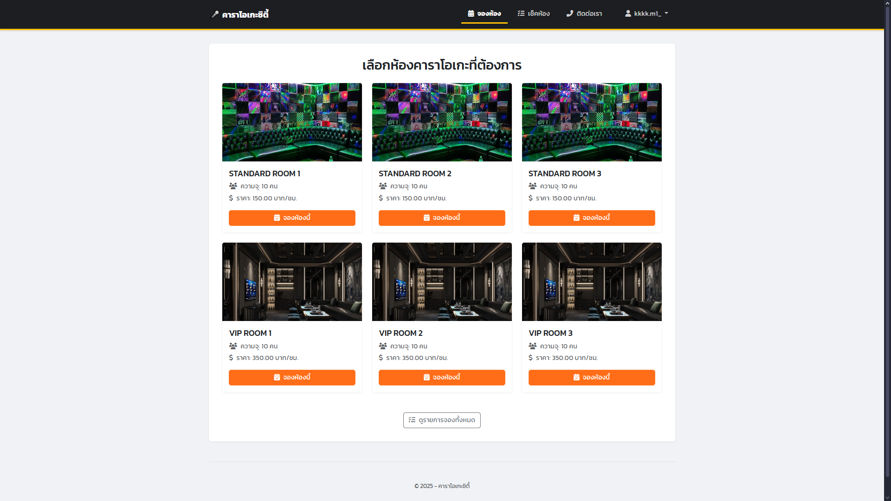
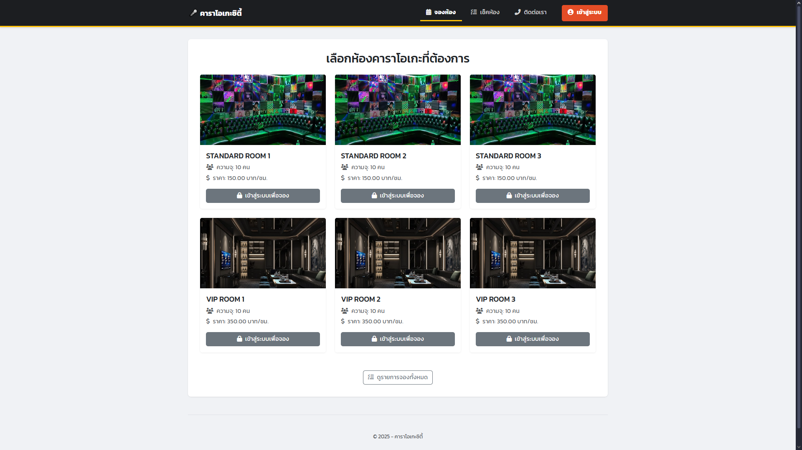
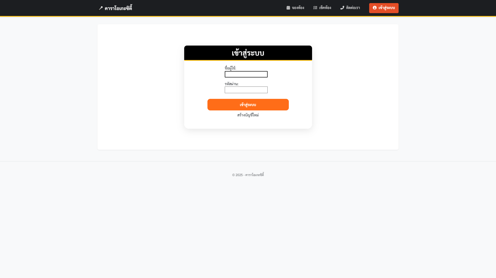
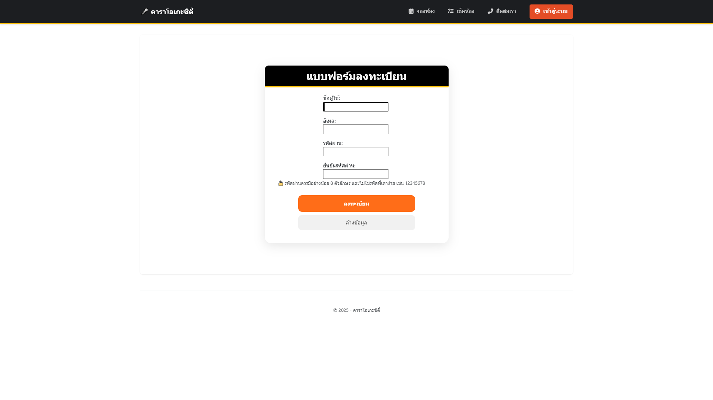
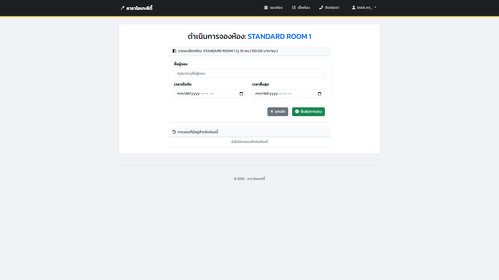
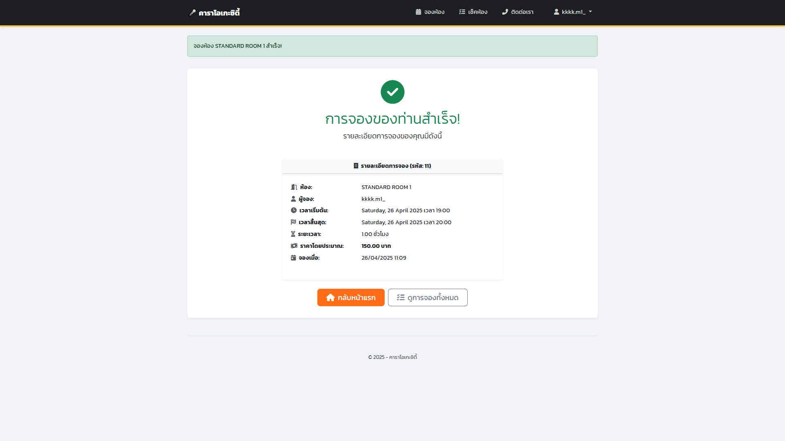
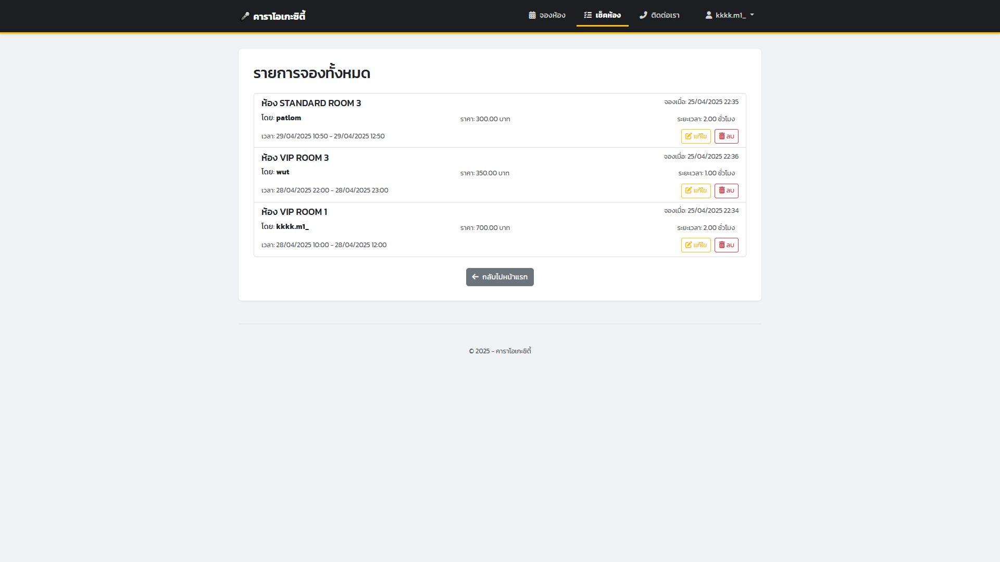
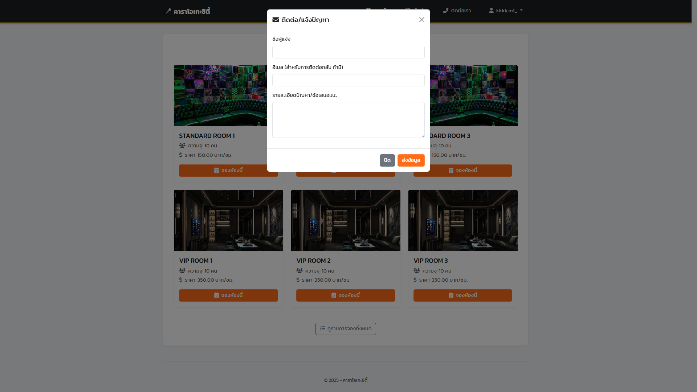

# Karaoke City - ระบบจองห้องคาราโอเกะด้วย Django

<p align="center">
  
</p>

<p align="center">
  
  
</p>

<p align="center">
  เว็บแอปพลิเคชันสำหรับระบบการจองห้องคาราโอเกะออนไลน์
</p>

---

## ภาพรวมโครงการ

คาราโอเกะซิตี้ (Karaoke City) เป็นเว็บแอปพลิเคชันที่พัฒนาขึ้นโดยใช้เฟรมเวิร์ก Django มีวัตถุประสงค์เพื่ออำนวยความสะดวกในการจัดการและจองห้องคาราโอเกะผ่านระบบออนไลน์ ระบบนี้ประกอบด้วยฟังก์ชันการทำงานที่ครอบคลุมตั้งแต่การจัดการผู้ใช้ไปจนถึงกระบวนการจองและการคำนวณค่าบริการ

---

## เทคโนโลยีที่ใช้

* **Backend Framework:** Django 4.2+
* **Frontend Framework:** Bootstrap 5.3
* **Database (Development):** SQLite
* **Authentication:** ระบบยืนยันตัวตนพร้อมการแยกสิทธิ์ระหว่างผู้ใช้ทั่วไป (User) และผู้ดูแลระบบ (Admin)

---

## คุณสมบัติหลัก

* **การจัดการผู้ใช้:**
    * ระบบลงทะเบียนสำหรับผู้ใช้ใหม่ (Register)
    * ระบบเข้าสู่ระบบ (Login)
    * (ตัวเลือกเพิ่มเติม) ฟังก์ชันกู้คืนรหัสผ่านผ่านทางอีเมล
* **การยืนยันตัวตนและความปลอดภัย:**
    * กำหนดให้ผู้ใช้ต้องเข้าสู่ระบบก่อนดำเนินการจองห้อง
* **ระบบการจอง:**
    * แสดงรายการห้องคาราโอเกะที่ว่างพร้อมรายละเอียด
    * แบบฟอร์มสำหรับกรอกข้อมูลการจอง (ชื่อผู้จอง, ห้อง, วันที่และเวลาเริ่มต้น-สิ้นสุด)
    * หน้าแสดงผลยืนยันเมื่อการจองเสร็จสมบูรณ์
    * แสดงประวัติการจองทั้งหมดของผู้ใช้งาน (หรือรายการจองทั้งหมดในระบบสำหรับผู้ดูแล)
    * ความสามารถในการแก้ไขและยกเลิกการจอง
* **การคำนวณอัตโนมัติ:**
    * คำนวณระยะเวลาการใช้บริการ (หน่วยเป็นชั่วโมง) จากข้อมูลการจอง
    * คำนวณค่าบริการตามอัตราค่าบริการของห้องและระยะเวลาที่จอง
* **การติดต่อและการสนับสนุน:**
    * แบบฟอร์มสำหรับติดต่อสอบถามหรือแจ้งปัญหา (แสดงผลในรูปแบบ Modal ภายใน Base Template)

---

## ภาพหน้าจอการทำงานของระบบ

**หน้าหลัก (ก่อนเข้าสู่ระบบ)**


**หน้าเข้าสู่ระบบ**


**หน้าลงทะเบียน**


**หน้าหลัก (หลังเข้าสู่ระบบ) / เลือกห้อง**


**แบบฟอร์มการจอง**


**หน้ายืนยันการจองสำเร็จ**


**หน้าประวัติการจองทั้งหมด**


**หน้าติดต่อ/แจ้งปัญหา (Modal)**


---
## โครงสร้างโปรเจกต์ (ส่วนสำคัญ)
```
kraoke_project/
├── accounts/                               # แอปพลิเคชันจัดการระบบผู้ใช้
│   ├── templates/
│   │   └── accounts/
│   │       ├── login.html                  # เทมเพลตหน้าเข้าสู่ระบบ
│   │       └── register.html               # เทมเพลตหน้าลงทะเบียน
│   └── ... (models.py, views.py, urls.py, etc.)
├── booking/                                # แอปพลิเคชันจัดการระบบการจอง
│   ├── templates/
│   │   └── booking/
│   │       ├── base.html                   # เทมเพลตหลัก (Navbar & Footer)
│   │       ├── all_bookings.html           # เทมเพลตแสดงรายการจองทั้งหมด
│   │       ├── booking_form.html           # เทมเพลตฟอร์มการจอง
│   │       ├── booking_success.html        # เทมเพลตแสดงผลเมื่อจองสำเร็จ
│   │       └── room_list.html              # เทมเพลตแสดงรายการห้อง
│   └── ... (models.py, views.py, urls.py, etc.)
├── kraoke_project/                         # โฟลเดอร์โปรเจกต์หลัก (settings.py, urls.py)
├── manage.py                               # สคริปต์จัดการ Django
└── README.md                               # เอกสารแนะนำโครงการ
```

## การติดตั้งและเริ่มใช้งาน (สำหรับ Development)

1.  **ติดตั้ง Django:**
    ```bash
    pip install django
    ```
    *(แนะนำ: ควรใช้ virtual environment และจัดการ dependencies ผ่าน `requirements.txt`)*

2.  **ทำการ Migrate ฐานข้อมูลและสร้าง Superuser:**
    ```bash
    python manage.py migrate
    python manage.py createsuperuser
    ```
    *(ปฏิบัติตามคำแนะนำเพื่อตั้งชื่อผู้ใช้, อีเมล, และรหัสผ่านสำหรับผู้ดูแลระบบ)*

3.  **รัน Development Server:**
    ```bash
    python manage.py runserver
    ```
    *แอปพลิเคชันจะพร้อมใช้งานที่ `http://127.0.0.1:8000/`*

---

## ข้อมูลติดต่อผู้พัฒนา

<div align="center">

| ช่องทาง         | ผู้พัฒนา 1                                                 | ผู้พัฒนา 2                                                        | ผู้พัฒนา 3                                                  |
| :------------- | :--------------------------------------------------------- | :--------------------------------------------------------------- | :--------------------------------------------------------- |
| **📧 Email** | <a href="mailto:minkridsada233@gmail.com">minkridsada233@gmail.com</a> | <a href="mailto:wuttipatphuakmaneeo@gmail.com">wuttipatphuakmaneeo@gmail.com</a> | <a href="mailto:Teeraphat15.km@gmail.com">Teeraphat15.km@gmail.com</a> |
| **🔗 GitHub** | <a href="https://github.com/minkpn">minkpn</a>             | <a href="https://github.com/wuttipatphuakmanee">Wuttipat</a>          | <a href="https://github.com/Teerapatkm">Patlom</a>              |

</div>
